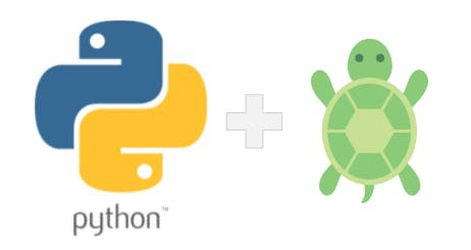

# Python-Turtle
Este repositorio contiene código del lenguaje python y tiene como finalidad, explicar las nociones básicas del lenguaje, así como las diferentes aplicaciones gráficas que se pueden hacer en el. A continuación se muestra las 3 formas en las que está dividido el Repositorio

## Aprendiendo Python

En esta sección se puede aprender las nociones básicas del lenguaje python, un poco de su historia, syntaxis, particularidades y códigos de uso básico para el aprendizaje del mismo. En esta sección encontrarás las siguientes carpetas:

- Básicos
- Ciclos de Repetición
- Funciones y Operaciones
- Errores y Excepciones
- Socket

## Aprendiendo Tkinter

## Aprendiendo Turtles

Creado por galigaribaldi0@gmail.com